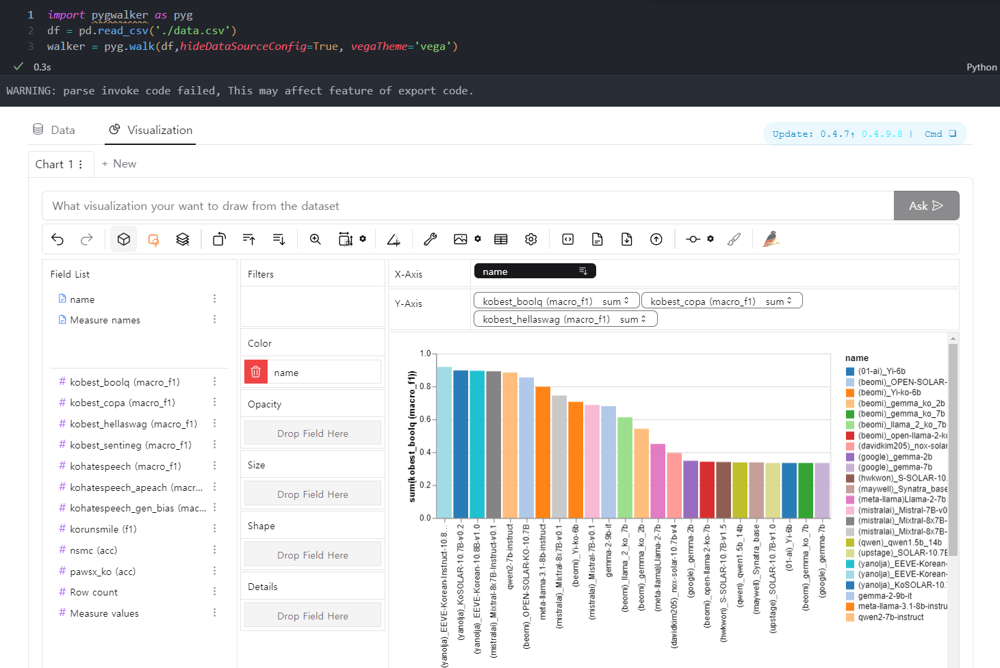

# LLM Model Evaluation and Visualization with Pygwalker

This repository contains the results of large language model (LLM) evaluation (lm-evaluation). The evaluation results are visualized using **Pygwalker** for better insights and analysis.

## Features
- Evaluation of various LLM models.
- Visual representation of the evaluation metrics using Pygwalker.

## lm-evaluation repo
- https://github.com/Beomi/ko-lm-evaluation-harness

## Visualization
